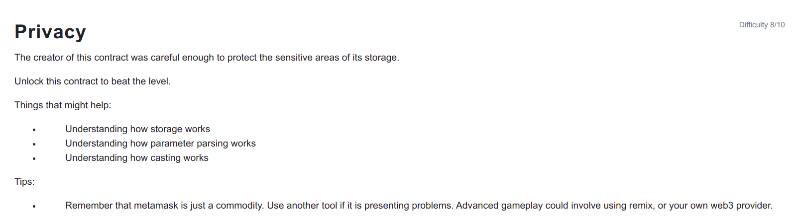

```
// SPDX-License-Identifier: MIT
pragma solidity ^0.6.0;

contract Privacy {

  bool public locked = true;
  uint256 public ID = block.timestamp;
  uint8 private flattening = 10;
  uint8 private denomination = 255;
  uint16 private awkwardness = uint16(now);
  bytes32[3] private data;

  constructor(bytes32[3] memory _data) public {
    data = _data;
  }
  
  function unlock(bytes16 _key) public {
    require(_key == bytes16(data[2]));
    locked = false;
  }

  /*
    A bunch of super advanced solidity algorithms...

      ,*'^`*.,*'^`*.,*'^`*.,*'^`*.,*'^`*.,*'^`
      .,*'^`*.,*'^`*.,*'^`*.,*'^`*.,*'^`*.,*'^`*.,
      *.,*'^`*.,*'^`*.,*'^`*.,*'^`*.,*'^`*.,*'^`*.,*'^         ,---/V\
      `*.,*'^`*.,*'^`*.,*'^`*.,*'^`*.,*'^`*.,*'^`*.,*'^`*.    ~|__(o.o)
      ^`*.,*'^`*.,*'^`*.,*'^`*.,*'^`*.,*'^`*.,*'^`*.,*'^`*.,*'  UU  UU
  */
}
```

<hr />

# Hack


Nothing is private at Blockchain as anything on blockchain can be read even if it has private keyword.


We can store atmost 2^256 state variables in the storage and we can store upto 32bytes in a slot. In this Privacy contract bool locked takes up 1byte and stored in slot 0 and uint256 ID takes 32 bytes and cannot be stored in slot 0 so it is stored in slot 1. flattening, denomination and awkwardness is stored in same slot 2 as they take exactly 32 bytes. And finally the fixed bytes32 array stores 3 items in slot 3 to 5 as each item is 32 bytes. If it was the dynamic array the storing of item would have been different.

```
contract Privacy {

  bool public locked = true; // slot 0
  uint256 public ID = block.timestamp; // slot 1
  uint8 private flattening = 10; // slot 2
  uint8 private denomination = 255; // slot 2
  uint16 private awkwardness = uint16(now); // slot 2
  bytes32[3] private data; // slot 3,4,5

  constructor(bytes32[3] memory _data) public {
    data = _data;
  }
  
  function unlock(bytes16 _key) public {
    require(_key == bytes16(data[2]));
    locked = false;
  }
}```

So finally we can run this command to unlock and set locked to false.
await web3.eth.getStorageAt(contract.address, 5)).slice(0,34) gets the 16 bytes of data[2] as it is at 5th slot.
slice(0,34) is done as 0x is present at start to denote the hex.

```
await contract.unlock(await web3.eth.getStorageAt(contract.address, 5)).slice(0,34));
await contract.locked();
```