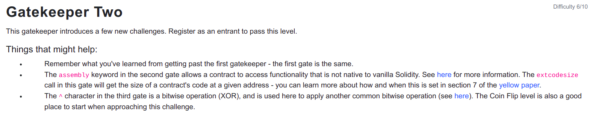

```
// SPDX-License-Identifier: MIT
pragma solidity ^0.6.0;

contract GatekeeperTwo {

  address public entrant;

  modifier gateOne() {
    require(msg.sender != tx.origin);
    _;
  }

  modifier gateTwo() {
    uint x;
    assembly { x := extcodesize(caller()) }
    require(x == 0);
    _;
  }

  modifier gateThree(bytes8 _gateKey) {
    require(uint64(bytes8(keccak256(abi.encodePacked(msg.sender)))) ^ uint64(_gateKey) == uint64(0) - 1);
    _;
  }

  function enter(bytes8 _gateKey) public gateOne gateTwo gateThree(_gateKey) returns (bool) {
    entrant = tx.origin;
    return true;
  }
}
```

<hr />

# Hack

Gate 1:
Passing gateOne() is same as before using a contract to call enter function.

Gate 2:
So for passing this gate, knowledge of assembly in solidity is required. extcodesize is used to get the size of the contract code at the given address. And to pass the test the size of the contract code must be zero and which can happen only when another contract calls GatekeeperTwo contract enter function from the constructor as the code is only stored at the end of the constructor execution as the contract hasnot been deployed yet.

Gate 3:
For passing gateThree we should have knowledge of XOR as ^ is bitwise XOR operation. In XOR, bitwise XOR of 0 and 1 and vice versa is 1 and 0 when bits are same.

1 ^ 1 = 0
0 ^ 1 = 1
1 ^ 0 = 1
0 ^ 0 = 0

And uint64(0) - 1 = 0xffffffffffffffff due to the underflow condition as safemath is required under solidity version 0.8.0 to avoid overflow and underflow conditions.

So for all the bits to be 1 on the left-hand side, uint64(_gateKey) must have bit 1 for 0 and 0 for 1 i.e bitwise NOT(~) boolean NOT operation on each bit. So finally, 
_gateKey = ~(bytes8(keccak256(abi.encodePacked(msg.sender))))

And the gateThree require condition will be true.
uint64(bytes8(keccak256(abi.encodePacked(msg.sender)))) ^ uint64(_gateKey) == uint64(0) - 1

```
// SPDX-License-Identifier: MIT
pragma solidity ^0.6.0;

contract GatekeeperTwoHack {
    bool public success = false;

    constructor(address _gateKeeperAddress) public {
        bytes8 gateKey = ~(bytes8(keccak256(abi.encodePacked(address(this)))));
        (success,) = _gateKeeperAddress.call(abi.encodeWithSignature("enter(bytes8)", gateKey));
    }
}
```

So passing all the gates we can write GatekeeperTwoHack contract with calculation of the gateKey and as we are calculating the gateKey on our contract msg.sender is equivalent to address(this) on our contract. And also calling the GatekeeperTwo enter function with its signature and gateKey arguments passes this level.