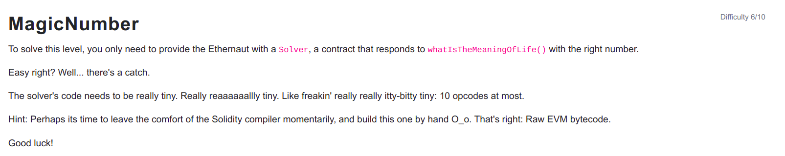

```
// SPDX-License-Identifier: MIT
pragma solidity ^0.6.0;

contract MagicNum {

  address public solver;

  constructor() public {}

  function setSolver(address _solver) public {
    solver = _solver;
  }

  /*
    ____________/\\\_______/\\\\\\\\\_____        
     __________/\\\\\_____/\\\///////\\\___       
      ________/\\\/\\\____\///______\//\\\__      
       ______/\\\/\/\\\______________/\\\/___     
        ____/\\\/__\/\\\___________/\\\//_____    
         __/\\\\\\\\\\\\\\\\_____/\\\//________   
          _\///////////\\\//____/\\\/___________  
           ___________\/\\\_____/\\\\\\\\\\\\\\\_ 
            ___________\///_____\///////////////__
  */
}
```

<hr />

# Hack

When solidity code compiles, it is converted to bytecode and bytecode is divided into two types a) Creation code b) Runtime code.

Creation code will never be part of the contract code but is only executed by the EVM once during the transaction that creates the contract and it is the code responsible for the setting of contract code initial state and as well as returing the copy of the runtime code.

Runtime code is the actual code of the contract and it will be saved in the blockchain which will be executed every time someone or something interacts with the contract.


So to solve this level, we have to construct bytecode and deploy the contract and set it address as the solver which returns the magic number 42 (0x2a) with using atmost 10 opcodes. Opcodes are the human readable representation of the low level instructions and each opcode takes 1 byte so the total opcodes used should be 10 bytes or less.

```
The hex values of all upcodes being used are:
PUSH1    -> 0x60
MSTORE   -> 0x52
RETURN   -> 0xf3
STOP     -> 0x00
CODECOPY -> 0x39
```

Runtime code:

So the runtime code should return the number 42 (0x2a)

```
012 PUSH1 2a  // Push 42 (0x2a) to stack
014 PUSH1 50  // Push 0x50 to stack
016 MSTORE    // Store 0x2a at memory position 0x50
017 PUSH1 20  // Push 0x20 to stack
019 PUSH1 50  // Push 0x50 to stack
021 RETURN    // Return value (0x2a) of size 0x20 (32 bytes) from memory position 0x50
```
So the runtime bytecode is 0x602a60505260206050f3

Creation code:

So this code should return the runtime code.
```
000 PUSH1 0a // Push 0x0a to stack
002 PUSH1 0c // Push 0x0c to stack
004 PUSH1 00 // Push 0x00 to stack
006 CODECOPY // Copies code of size 0x0a from 0x0c instruction number to 0x00 memory position.
007 PUSH1 0a // Push 0x0a to stack
009 PUSH1 00 // Push 0x00 to stack
011 RETURN   // Return value of size 0x0a from 0x00 memory position.
```
So the creation bytecode is 0x600a600c600039600a6000f3

So bytecode is the concatenation of contract and runtime code = creation code + runtime code = 0x600a600c600039600a6000f3602a60505260206050f3

So finally we can create the contract using this bytecode by sending the transaction to 0x0 address and setting the solver address to the currently deployed contract will pass this level.

```
const bytecode = "0x600a600c600039600a6000f3602a60505260206050f3"
const transaction = await web3.eth.sendTransaction({from: player, data: bytecode})
await contract.setSolver(transaction.contractAddress);
```

Submit the instance and congratulations we passed this level.

So in this level we learnt some low level instructions to pass it.