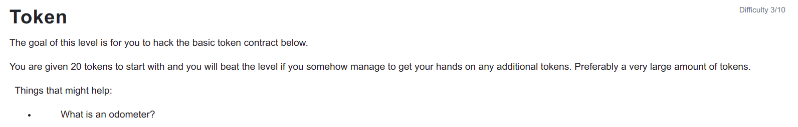

```
// SPDX-License-Identifier: MIT
pragma solidity ^0.6.0;

contract Token {

  mapping(address => uint) balances;
  uint public totalSupply;

  constructor(uint _initialSupply) public {
    balances[msg.sender] = totalSupply = _initialSupply;
  }

  function transfer(address _to, uint _value) public returns (bool) {
    require(balances[msg.sender] - _value >= 0);
    balances[msg.sender] -= _value;
    balances[_to] += _value;
    return true;
  }

  function balanceOf(address _owner) public view returns (uint balance) {
    return balances[_owner];
  }
}
```

<hr />

# Hack

Overflows and Underflows are problem in smart contract before v8.0 and we have to use the additions and substractions carefully otherwise it may lead to serious damage. In this case we are given 20 tokens and if we try to send the 21 tokens in the _value of the transfer function, require will pass as it will underflow and will have the largest uint256 integer and it will lead us to have largest amount of tokens with us.

The max value uint256 can hold is 2^(256) - 1 and when sending the 21 tokens it cause underflow and balances[msg.sender] will store that maximum value for us making us the owner of 2^256 - 1 tokens.

Under the overflow condition if (2^(256) + 1) is added to 1, the value will be equal to zero.

```
await contract.transfer("0x0000000000000000000000000000000000000000", 21);
```